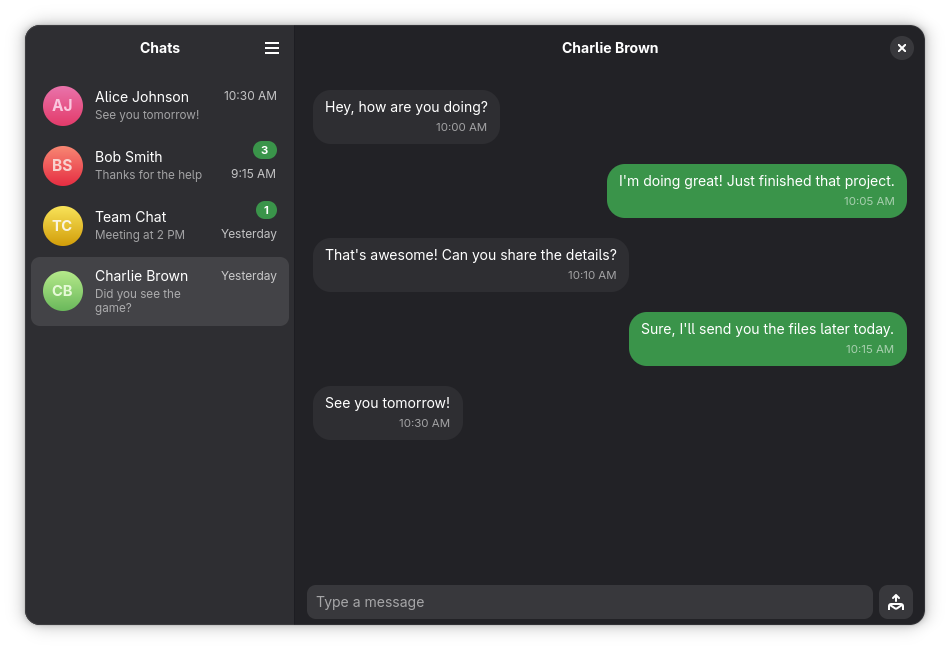

# Zap - WhatsApp Client for GNOME

A WhatsApp client for the GNOME desktop, built with GTK 4 and libadwaita to provide a native messaging experience that integrates seamlessly with your desktop environment.

> [!IMPORTANT]
> This project is not affiliated with, endorsed by, or associated with WhatsApp, Meta Platforms Inc., or any of their subsidiaries. This is an independent open-source project inspired by modern chat application design patterns.



## Features

- **Modern GTK 4 Interface**: Built with the latest GTK 4 and libadwaita for a native GNOME experience
- **Native WhatsApp Experience**: Familiar chat interface with WhatsApp functionality
- **Multi-Platform**: Distributed via Flatpak for easy installation across Linux distributions
- **TypeScript Development**: Type-safe development with TypeScript and proper type definitions
- **Responsive Layout**: Adaptive interface that works well on different screen sizes
- **Native GNOME Integration**: Follows GNOME Human Interface Guidelines and integrates seamlessly with the desktop

## Screenshots


*Main chat interface with conversation view*


*Welcome screen with modern design*

## Technology Stack

- **Language**: TypeScript (compiled to JavaScript for GJS runtime)
- **UI Framework**: GTK 4 + libadwaita 1.x with Blueprint markup
- **Runtime**: GJS (GNOME JavaScript) with GObject introspection
- **Build System**: Meson + Blueprint compiler + TypeScript compiler
- **Package Manager**: Bun (for TypeScript tooling)
- **Distribution**: Flatpak

## Prerequisites

Before building Zap, ensure you have the following dependencies installed:

- Bun (for TypeScript compilation and tooling)
- Meson build system (>= 0.62.0)
- Blueprint compiler (`blueprint-compiler`)
- Flatpak development tools
- GTK 4 and libadwaita development libraries
- GJS (>= 1.54.0)

### Installing Dependencies

On Fedora/RHEL:
```bash
sudo dnf install meson blueprint-compiler flatpak-builder gtk4-devel libadwaita-devel gjs
```

On Ubuntu/Debian:
```bash
sudo apt install meson blueprint-compiler flatpak-builder libgtk-4-dev libadwaita-1-dev gjs
```

On Arch Linux:
```bash
sudo pacman -S meson blueprint-compiler flatpak-builder gtk4 libadwaita gjs
```

Install Bun:
```bash
curl -fsSL https://bun.sh/install | bash
```

## Installation

### From Flatpak (Recommended)

```bash
# Add Flathub repository (if not already added)
flatpak remote-add --if-not-exists flathub https://flathub.org/repo/flathub.flatpakrepo

# Install Zap
flatpak install sh.alisson.Zap
```

### Building from Source

1. **Clone the repository:**
```bash
git clone https://github.com/alissonlauand/zap.git
cd zap
```

2. **Install TypeScript dependencies:**
```bash
bun install
```

3. **Configure and build with Meson:**
```bash
meson setup builddir
meson compile -C builddir
```

4. **Install locally (optional):**
```bash
meson install -C builddir
```

## Development

### Setting Up Development Environment

1. **Configure debug build:**
```bash
meson setup builddir --buildtype=debug
```

2. **Compile TypeScript and Blueprint files:**
```bash
meson compile -C builddir
```

3. **Run the application in development mode:**
```bash
meson devenv -C builddir ninja devel
```

### Build Commands

**Development Build:**
```bash
meson setup builddir --buildtype=debug
meson compile -C builddir
meson devenv -C builddir ninja devel
```

**Production Build:**
```bash
meson setup builddir --buildtype=release
meson compile -C builddir
flatpak-builder --repo=repo build-aux/flatpak/sh.alisson.Zap.json
```

**TypeScript Compilation Only:**
```bash
# Type check without emitting files
bun run tsc --strict --noEmit

# Build TypeScript files to JavaScript
bun run tsc --strict
```

### Testing

**TypeScript Type Checking:**
```bash
bun run tsc --strict --noEmit
```

**Run Application:**
```bash
meson devenv -C builddir ninja devel
```

**Test Flatpak Build:**
```bash
flatpak-builder --user --install --force-clean build-aux/flatpak/sh.alisson.Zap.json
flatpak run sh.alisson.Zap
```

### Debugging

**Enable GTK Debug Output:**
```bash
GTK_DEBUG=all meson devenv -C builddir ninja devel
```

**Debug Specific GTK Modules:**
```bash
GTK_DEBUG=actions,widgets meson devenv -C builddir ninja devel
```

**GJS Debugging:**
```bash
gjs -d ./builddir/src/sh.alisson.Zap
```

## Project Structure

```
zap/
├── src/                          # Source code
│   ├── core/                     # Core application components
│   │   ├── logger.ts            # Centralized logging
│   │   └── window/              # Main window with navigation
│   ├── features/                # Feature-specific modules
│   │   ├── auth/                # Authentication features
│   │   └── chat/                # Chat features
│   ├── shared/                  # Shared utilities and services
│   ├── resources/               # Resource files (styles, gresource.xml)
│   └── types/                   # TypeScript type definitions
├── data/                        # Application data and icons
├── po/                          # Translation files
├── build-aux/                   # Build configuration
└── src/                         # TypeScript source files
```

## Contributing

We welcome contributions! Please see our [Contributing Guidelines](CONTRIBUTING.md) for details.

### Quick Start for Contributors

1. Fork the repository
2. Create a feature branch (`git checkout -b feature/amazing-feature`)
3. Make your changes
4. Run type checking (`bun run tsc --strict --noEmit`)
5. Commit your changes (`git commit -m 'Add some amazing feature'`)
6. Push to the branch (`git push origin feature/amazing-feature`)
7. Open a Pull Request

### Code Style

- Use strict TypeScript configuration with explicit types
- Follow GNOME Human Interface Guidelines
- Use libadwaita widgets (Adw.*) over plain GTK when available
- Keep UI definitions separate in .blp files
- Use CSS classes for styling, avoid inline styles

## License

This project is licensed under the GPL-3.0 License - see the [LICENSE](LICENSE) file for details.

## Acknowledgments

- Built with [GTK](https://gtk.org/) and [libadwaita](https://gnome.pages.gitlab.gnome.org/libadwaita/)
- Uses [GJS](https://gitlab.gnome.org/GNOME/gjs/) for JavaScript bindings
- Inspired by modern chat applications and GNOME design principles

## Support

If you encounter any issues or have questions:

- Create an issue on [GitHub Issues](https://github.com/alissonlauand/zap/issues)
- Check the [Wiki](https://github.com/alissonlauand/zap/wiki) for documentation
- Join our [Discussions](https://github.com/alissonlauand/zap/discussions)

---

> [!NOTE]
> This is a desktop application that requires a Linux environment with GTK 4 support. For the best experience, we recommend using GNOME or a GTK-based desktop environment.
